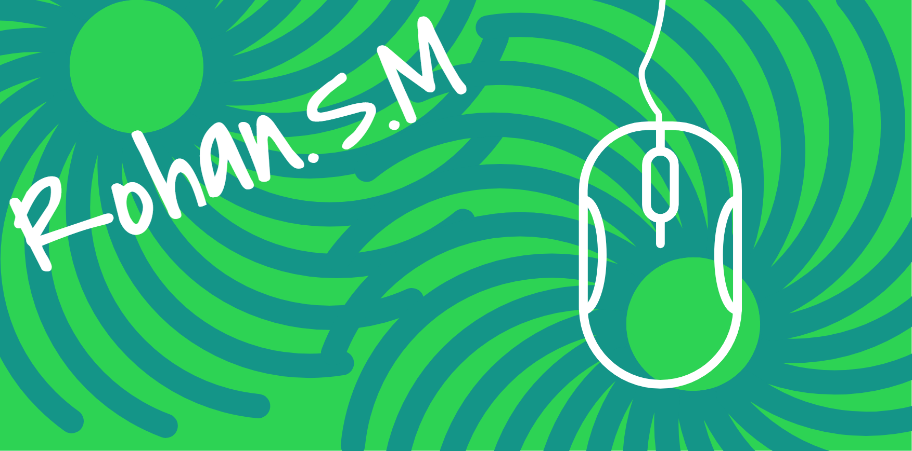

<!--- [](https://git.io/typing-svg) --->




<p align="center">
  <a href="https://rohan-shridhar.github.io/portfolio/">
    
  </a>
</p>


## 🚀 About Me
### I am  passionate about creating interactive and user-friendly web applications. You can view my portfolio by clicking the icon above.

---
### ✍️ A Random Thought
```txt
 Old hindi songs are so nice 💫
````

### 📊 GitHub Stats

<p align=center>


</p>

<p align=center>
    
</p>

### 🌐 Connect with me
<p align=center>
  <a href="https://github.com/rohan-shridhar" target="_blank"></a>
  <a href="https://linkedin.com/in/rohan-mirjankar" target="_blank"></a>
  <a href="https://instagram.com/rohan.mirjankar" target="_blank"></a>
  <a href="https://twitter.com/Rohan_shridhar" target="_blank"></a>
</p>


