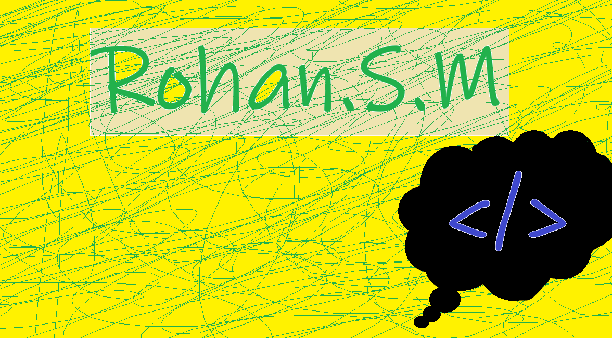

<p align="center">
  <a href="https://rohan-shridhar.github.io/portfolio/">
    
  </a>
</p>


## 🚀 About Me
### I am  passionate about creating interactive and user-friendly web applications. You can view my latest projects by clicking the icon above.


<p align="center">


</p>

[)](https://git.io/typing-svg)


---
### ✍️ Quote of the day
```txt
  Statistics is not easy...😔
````
<p align=center>


</p>


### 📊 GitHub Stats
<p align="center">
  
</p>

---

### 🌐 Connect with me
<p align="left">
  <a href="https://github.com/rohan-shridhar" target="_blank"></a>
  <a href="https://linkedin.com/in/rohan-mirjankar" target="_blank"></a>
  <a href="https://instagram.com/rohan.mirjankar" target="_blank"></a>
  <a href="https://twitter.com/Rohan_shridhar" target="_blank"></a>
</p>
