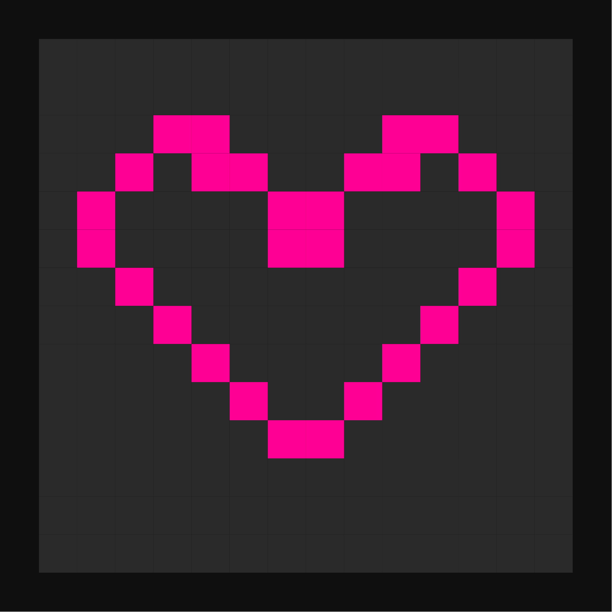
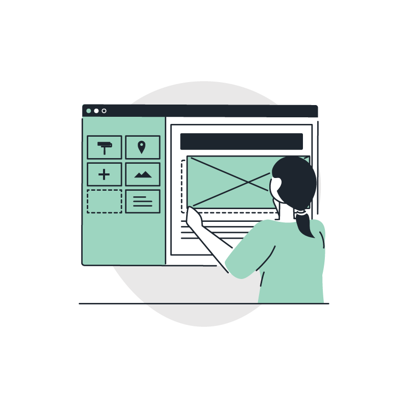
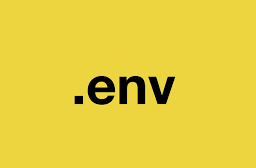

  

<!--

--->

<!--

  

--->

---
## ✍️ About me  

<h4><i>
🧑‍🎓 CS UG Student from BMSCE, Bangalore   
🧑‍💻 Learning Fullstack Web Development   
🌍 Contributing open source projects   
🤝 Always open to collaborate   
</h4></i>

## 💻 Tech stack

   

   

   
</a>

## 🧩 My popular projects

<table>
  <tr>
    <td width="50%" valign="center" align="center">
      
    <td width="50%">
      <h3><a href="https://rohan-shridhar.github.io/gridcraft/">Gridcraft<a/><h3/>
      <h5>Pixel art application with adjustable grid and download image feature<h5/>
      
  </tr>
</table>

## 🧰 NPM Packages

<table>
    <tr>
    <td width="50%" valign="center" align="center">
      
    <td width="50%">
      <h3><a href="https://www.npmjs.com/package/@rohansm14/react-pages">React-pages<a/><h3/>
      <h5>A React component library for plug-and-play utility pages, starting with a fully customizable 404<h5/>
           
  </tr>
  <tr>
    <td width="50%" valign="center" align="center">
      
    <td width="50%">
      <h3><a href="www.npmjs.com/package/ciphex?activeTab=readme">Ciphex<a/><h3/>
      <h5>Lightweight text encryption & decryption combining Vigenère and Affine ciphers<h5/>
         
  </tr>
  <tr>
    <td width="50%" valign="center" align="center">
      
    <td width="50%">
      <h3><a href="https://www.npmjs.com/package/@rohansm14/envguard?activeTab=readme">Envguard<a/>       <h3/>
      <h5>A zero-boilerplate environment variable validator and analysis tool for Node.js<h5/>
          
  
  </tr>
</table>

---

## 🌍 My open source contributions

<table>
  <tr>
    <td width="50%" valign="center" align="center">
      
    <td width="50%">
      <h3><a href="https://github.com/renuthomas/qr-code-snipper">QR Snipper<a/></h3>
      <h5>Chrome extension that can be used to snip qr code from the window and store the urls locally - by <a href="https://github.com/renuthomas">renuthomas<a/></h5>
        <h4>PRs: <a href="https://github.com/renuthomas/qr-code-snipper/pull/2">#2<a/>, <a href="https://github.com/renuthomas/qr-code-snipper/pull/4">#4<a/>, <a href="https://github.com/renuthomas/qr-code-snipper/pull/8">#8<a/></h4>
        
  </tr>
  <tr>
    <td width="50%" valign="center" align="center">
      
    <td width="50%">
      <h3><a href="https://github.com/vallabhatech/CareSync">CareSync<a/></h3>
      <h5>A smart, modular web app for medicine tracking, symptom checking, and clinic discovery, making healthcare simple and accessible. - by <a href="https://github.com/vallabhatech">vallabhatech<a/></h5>
        <h4>PRs: <a href="https://github.com/vallabhatech/CareSync/pull/6">#6<a/>, <a href="https://github.com/vallabhatech/CareSync/pull/51">#51<a/></h4>
        
  </tr>
    <tr>
    <td width="50%" valign="center" align="center">
      
    <td width="50%">
      <h3><a href="https://github.com/smrithipiedy/BallotIQ">BallotIQ<a/></h3>
      <h5>BallotIQ is an election process education platform where users can learn about elections in different countries by either interacting with the assistant or learning through tailored, informative learning modules and quizzes. - by <a href="https://github.com/smrithipiedy">smrithipiedy<a/></h5>
        <h4>Prs: <a href="https://github.com/smrithipiedy/BallotIQ/pull/2">#2<a/>, <a href="https://github.com/smrithipiedy/BallotIQ/pull/7">#7<a/><h4/>
        
  </tr>
</table>

[Explore all projects---->](https://rohan-shridhar.github.io/rohan-shridhar/)

---

### 📊 GitHub Stats

  

 

  
<!--

    

-->

<!--

  

--->

### 📸 Meme of the week. 

### 🌐 Connect with me

  
  
  
  </a>
  </a>

<!--

-->
